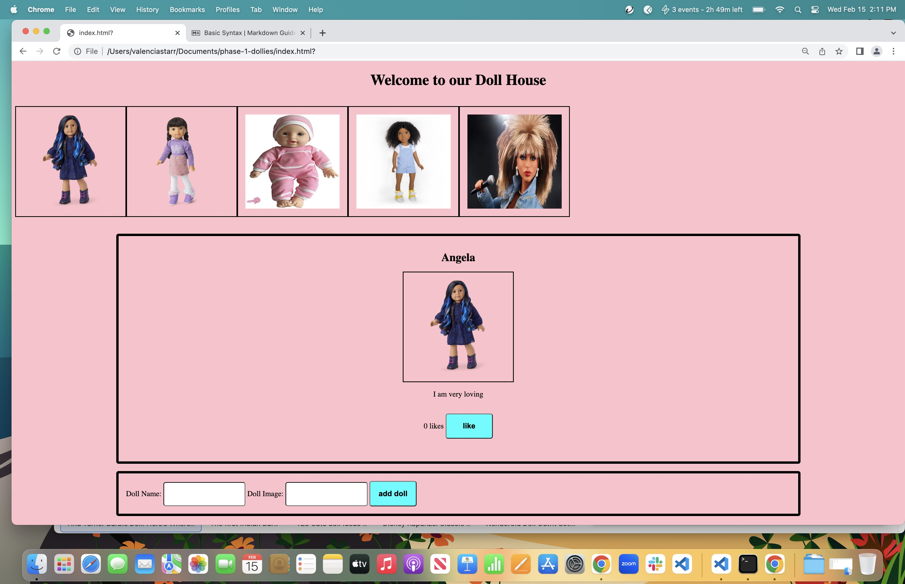

# Welcome to our Doll House

## You are to build a website display all the dolls in our Doll House.  Your website should look like this:

## Run json-server --watch db.json to get the server running.  Your data should be at this URL: http://localhost:3000/dollies

## Deliverable 1
Do a fetch get request to fetch all of the dolls and display their images in the #doll-nav div.  

## Deliverable 2
Upon clicking the doll image from the nav, display the doll name, description, photo, and likes in the appropriate sections within the #doll-display div.  For example, the doll name should be displayed in the #doll-name element

## Deliverable 3
Be able to add a new doll and display its image in the nav and upon clicking the image display the doll details in the appropriate sections in the #doll-display div without the page reloading.    

## Deliverable 4
Be able to click the button to increase number of likes for the doll display.  You do not need to persist number of likes between clicking each doll image.

## Bonus Deliverable
Be able to increase the number of likes for ONLY the doll displayed and the number of likes for the doll persists between clicking each doll image.

# phase-1-dollies-practice-code-challenge
# phase-1-dollies-practice-code-challenge
